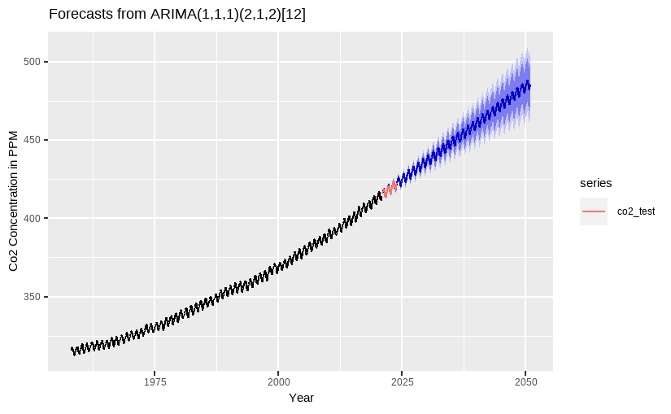

# CO2 Concentration Forecasting

## Data
The original source of the historical atmospheric concentration of CO2 is availabe [at Mauna Loa in Hawaii](https://gml.noaa.gov/ccgg/trends/mlo.html).
The data set contains monthly average measurements from 1958 until today. The Mauna Loa carbon dioxide concentration is not identical to the entire atmospheric average, but it's pretty close.

## Methodology
I chose a seasonal ARIMA model because it works well with time series data, which relies on past values. Since CO2 concentration is linked to its previous levels, this model seemed like a good fit.

The final model chosen was ARIMA(1, 1, 1)(2, 1, 1)[12].

## Requirements
These libraries are needed:
* **Wrangling and visualizations** - tidyverse, lubridate
* **Calculations** - zoo
* **Time series analysis and forecasting** - forecast

## Key Insights

The CO2 concentration is increasing rapidly, reaching over 400 ppm in the 21st century.

There is a clear increasing trend and seasonal variation. The CO2 concentration increases up to May, then drops and increases again in October. According to [NOAA](https://www.climate.gov/news-features/understanding-climate/climate-change-atmospheric-carbon-dioxide), this is driven by Northern Hemisphere summer vegetation growth, which reduces atmospheric CO2, and winter decay, which increases it.

ARIMA captures the trend and the seasonal effects, so it could be used for a monthly forecasting but probably not for far in the future.

